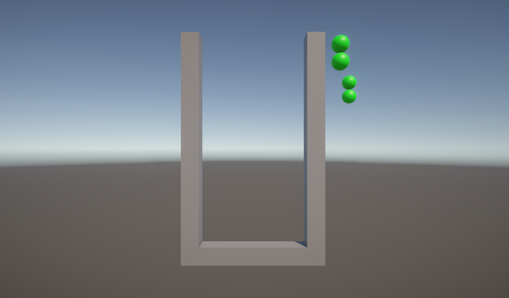
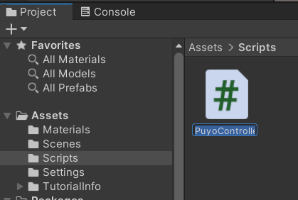
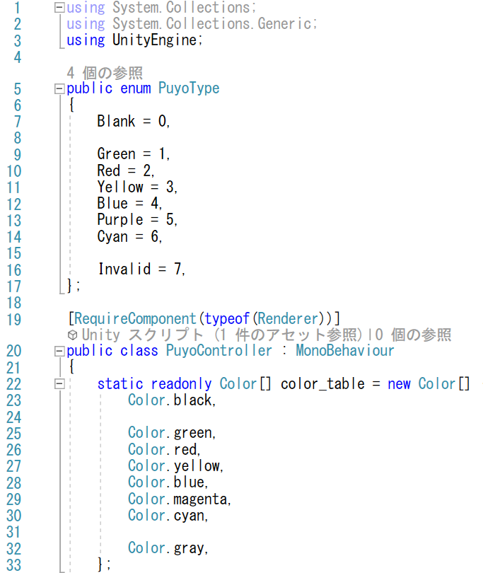
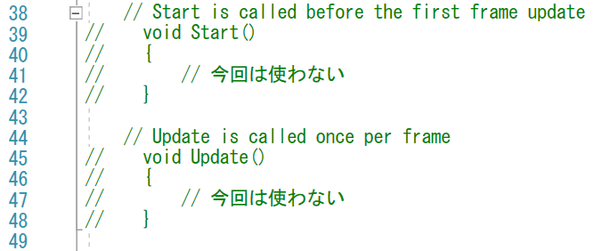
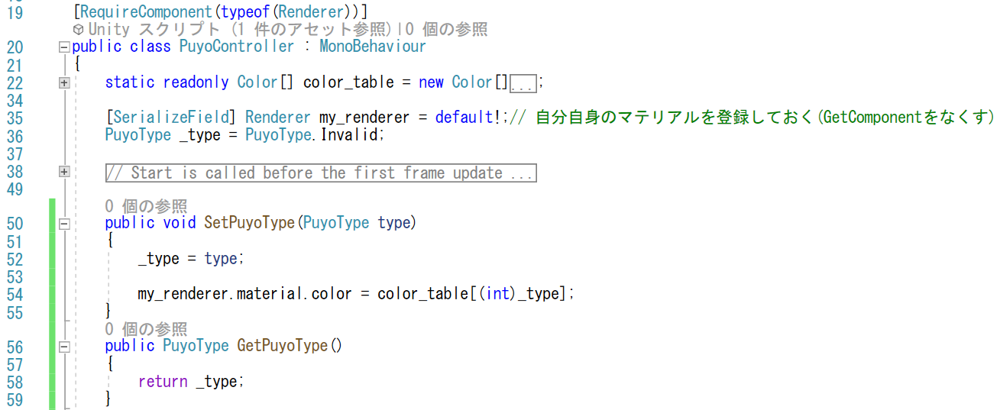
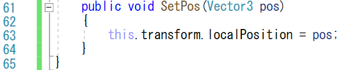
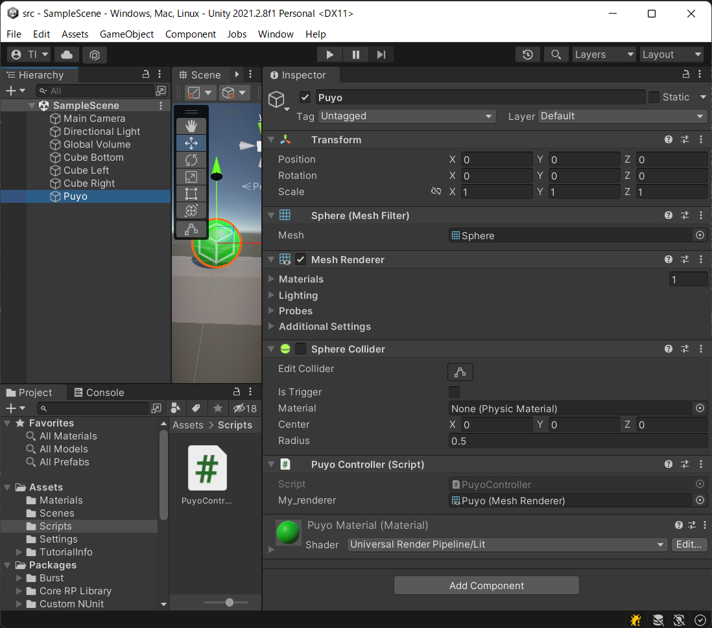
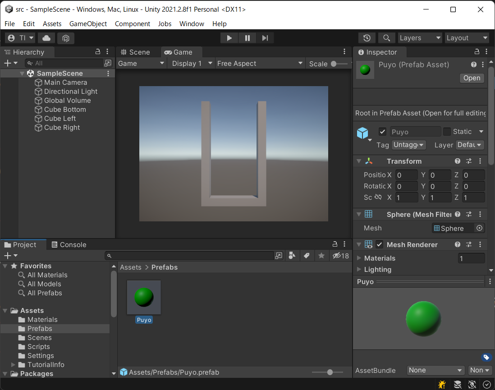
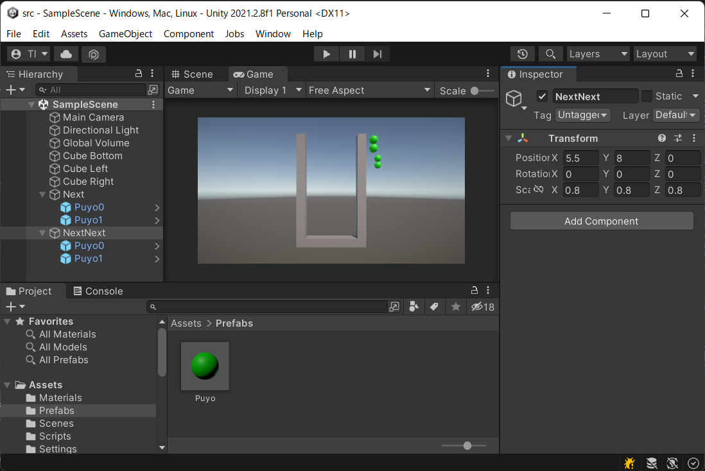

# 概要
Prefabを作って、「オブジェクト」を学びましょう。
プログラミングにはオブジェクト指向の考え方がありますが、
オブジェクト指向では、オブジェクト間のメッセージで世界を構築します。
Unityでは実際にメッセージングするのはC#スクリプトですが、
オブジェクトの塊としては、組み込まれたCubeやSphereだけではなく
Prefabもオブジェクトのひな型とすすることができます。
ここでは、ぷよ一つをPrefabにしてみましょう。

Prefab化したぷよを次に降ってくる候補として表示しましょう（今回は、表示だけで、色変えはしません）

# 手順

## スクリプトを追加する
- C# スクリプトを追加(Scriptsフォルダを作って、スクリプトを追加(PuyoController))

## スクリプトに列挙型を定義
- 列挙型を定義する
  - 列挙型メンバーでしか色を指定できないようにする（安全性の向上のため）
  - 未定義に対応する「0」
  - 不正に対応する最大の値「7」を定義する
    - 「-1」が使われることも多いが、色の配列を自然に取得できるように今回は最大値を選択
- 列挙型に対応する色を定義する
  - PuyoController の中でしか色の値を制御できないようにカプセル化

- 他のオブジェクトからの指令を受けて色を変えられるようにする

## StartやUpdateを削除
- 今回は使わないので不要なコードは消す（本当に消してよい）

## 種類を設定できるようにする
- set/getを導入
- 自分自身の色を変えられるように、Rendererを保持する
  - GetComponet は重いので、使わないようにする
    - [SerializeField] でエディターで指定する形にする
    - 設定忘れがないように「=defeult!」で非null指定しておく
    - 「RequireComponent」をつけて、Rendererコンポーネントのつけ忘れも防ぐ
- type が設定されたときに引数のテーブル引きで色を設定

## 種類を設定できるようにする
- 外部から位置を変えるためのSetPosを用意する
  - 外部で直接 transform を修正するのは野蛮
    - デバッグ機能を追加したり、補正して位置を設定する余地を残す

## スクリプトをバインドする
- スクリプトを Sphere (Puyo) のオブジェクトにD&D
- スクリプトの My_renderer に Sphere (Puyo) をD&Dして自分自身を設定
- Sphere Collider は使わないので非アクティブ化
  - removeしても良い

## Prefab化
- Assets にPrefabsフォルダを作成
  - フォルダの構成にはいくつかの考え方がある。今回は種類別
- Sphere (Puyo) をPrefabsフォルダにD&D

## 次のぷよを置く
今回は配置のみ(2つ先まで表示するようにする)
- まとめて置くのに便利なように「Create Empty」を2個追加
  - 「Next」と「NextNext」とここでは名前を付けた
  - 「Next」は近くに配置
    - 位置は(5, 10, 0)
  - 「NextNext」は少し遠くに小さく表示
    - 位置は(5.5, 8, 0)
    - 拡大縮小は(0.8, 0.8, 0.8)

